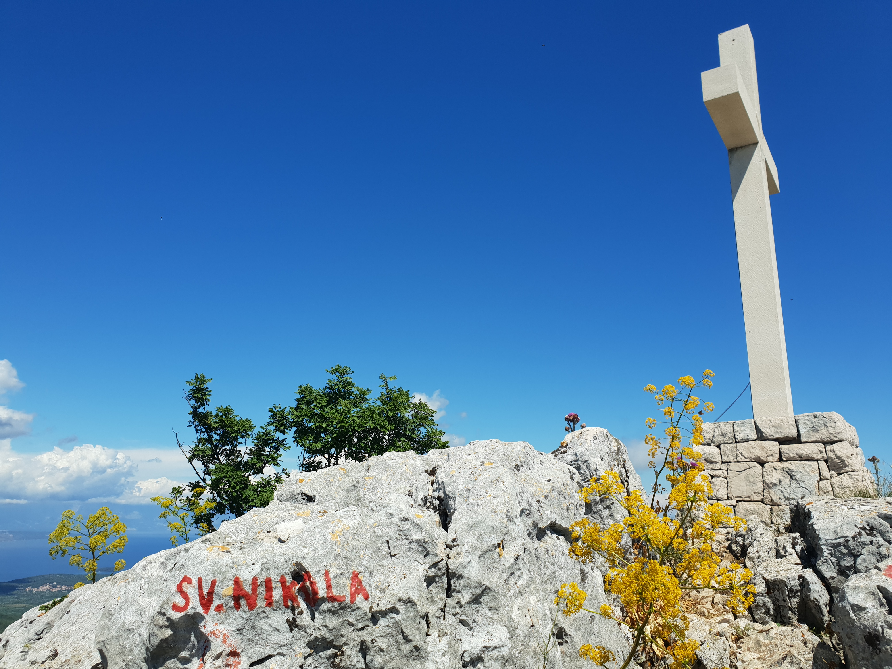

Start at the church parking and follow the road around the school building until you see a hiking sign (red-white dot). Take the left gravel road leading into the forest that ascends in winding turns. For the first hour you walk amidst the greens following the only obvious path, at the only crossroads turn right and follow the 707 bicycle path sign. After a while, the road will begin to ascent more and you will be able to see the forest you just passed. Saint Nikola peak will become visible as you enter the short valley. At the end of the valley you will reach the crossroads where paths from the Tunel and Selo join. Turn left and ascend onto the plateau. Walk through the agricultural tourism settlement and turn right at the crossroads where the road from Svirče joins. Turn left and approach the final ascent to the top of the island through the gate. Path from Sveta Nedelja joins from the right. Follow the steep road until the tree and climb last 50m on the unmarked path, pass the small building, cross until you reach the chapel on top.

