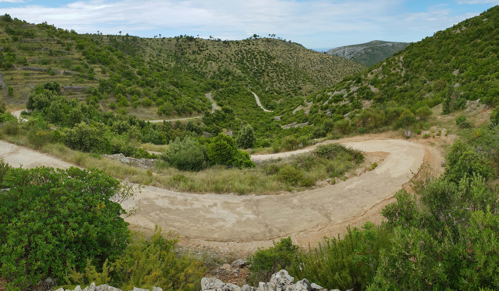

To je najlakši put automobilom do vrha (betonska-makadamska na nekim mjestima loše održavana cesta, možete doći i do 50 m ispod vrha). Za pješački prilaz se parkirajte na posljednjem skretanju ispred tunela s hvarske strane (znak za planine seoskog turizma Kolumbić, ovo nije ista staza koja vodi do Svete Nedilje 200m niže - dalje od tunela). Kod  uspinjanja se put postupno penje kroz obrađena polja i otvara zanimljive poglede. Nakon 45 minuta stižemo do raskrižja, gdje se nam iz lijeve strane pridružuje staza od Selca (biciklistička staza 709). Nastavljamo udesno u smjeru Svetog Nikole. Nakon 20 minuta strmog uspona duž visoravni, dolazimo do odvojka, gdje se s Dola pridružuje put. Nastavite desno prema gornjoj visoravni. Put pokraj seoskog turizma vodi nas na raskrižje, gdje skrećemo desno (put iz Svirča pridružuje nam se ravno). Nastavljamo levo uz cestu koja se kod znaka spaja s grebenom staze od Svete Nedilje. Slijedi još zadnji uspon do kraja ceste, nakon toga imamo još samo posljednjih 50 metara uspona gdje prolazimo pokraj malene zgrade, križa i dalje do kapele na vrhu.

