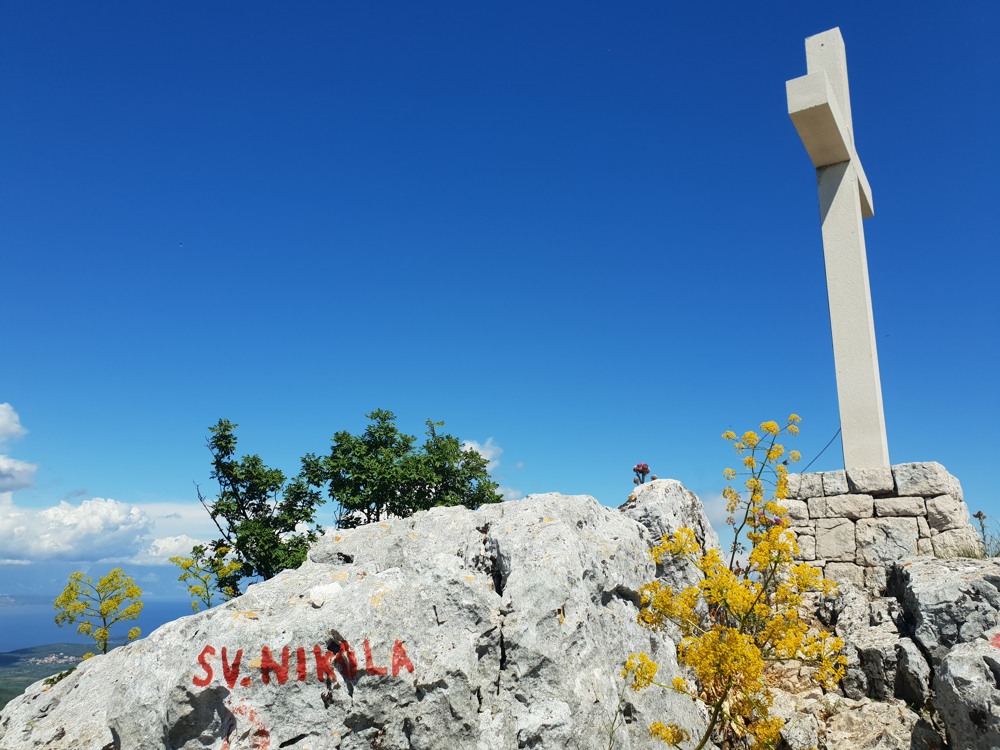

Sledimo cesti do konca naselja in parkiramo nekje ob poti (ali višje, če si želimo skrajšati pohod). Čez majhen most pri prvem križišču izberemo levo pot, nato pa po nekaj 100 metrih na naslednjem križišču za kozjo farmo izberemo desno pot (sledimo znaku za kolesarsko pot 708). Mestoma makadamska ali betonirana pot se zložno vzpenja med polji sivke dokler ne dosežemo naslednjega križišča, kjer izberemo zgornjo, levo pot. V enem kilometru strme poti dosežemo levi ovinek, ki nam odpre pogled v prihajajočo dolino, zapre pa nam pogled na Svirče in Jelso (nazaj). Poti skozi dolino sledimo proti vrhu (na edinem križišču nadaljujemo naravnost) in le-ta nas v dveh serpentinah pripelje na križišče, kjer zavijemo desno na planoto. Odpre se nam pogled na vrh. Sledimo glavni makadamski poti (1 km) do sredine planote (ko prispemo do kapelice na desni strani) se na levi strani odcepi pot za vzhodni dostop do vrha. Pot je zaraščena (ročno napisan znak nas usmeri v ozek koridor med dvema poljema, zapustimo glavno cesto). Sledimo nevzdrževani, zaraščeni poti na drugo stran polja (proti vrhu, prvih 50 m veliko grmovja, nato ok). Poiščemo pot, ki se v začetku serpentinasno pne proti vrhu skozi redek gozd in se priključi pešpoti iz Svete Nedilje - vzhodni pristop. Na razpotju zavijemo desno in v 20 minutah dosežemo vrh.

Alternativno se lahko vrnemo v Svirče po zahodnem pristopu, mimo turistične kmetije.

